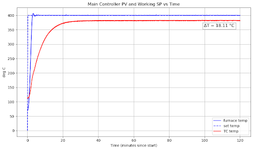

# SHIELD Data Processing  
### Colin Weaver • MIT Plasma Science & Fusion Center • Hydrogen Transport & Permeation Diagnostics

---

## Overview

The **SHIELD** platform (Selective Hydrogen Isotope Experiment for Layered Diffusion) is MIT’s reference **Gas-Driven Permeation (GDP)** facility for characterizing hydrogen, deuterium, and tritium transport in structural alloys and advanced coatings.

Hydrogen permeation through materials is central to:
- fusion reactor blanket design  
- tritium containment and accountancy  
- hydrogen pipelines and storage systems  
- aerospace and energy applications  

However, analyzing permeation experiments requires careful handling of:
- high-resolution pressure signals  
- thermocouple & furnace temperature data  
- transient and steady-state permeation evolution  
- multistage run/bake sequences  
- Arrhenius extraction of diffusivity, solubility, and permeability  

This repository contains the **Python analysis toolkit** for processing all SHIELD furnace data.

---

## SHIELD Rig Schematic

<p align="center">
  
</p>

---

## What This Repository Does

### **1. Furnace & Thermocouple Processing**
- Temperature extraction  
- Heating/cooling rate analysis
- Sample temperature vs set temperature analysis

---

<p align="center">
  
</p>

---

## SHIELD Manuscript (Temporary Reference)

**SHIELD: A Reference Gas-Driven Permeation Platform for Hydrogen Permeation Studies**  
J. Dark, C. Weaver, R. Delaporte-Mathurin, S. Ferry, K. B. Woller  
MIT Plasma Science and Fusion Center  
(Submitted / In preparation)

```bibtex
@article{dark2025shield,
  title={SHIELD: A Reference Gas-Driven Permeation Platform for Hydrogen Permeation Studies},
  author={Dark, J. and Weaver, C. and Delaporte-Mathurin, R. and Ferry, S. and Woller, K.B.},
  institution={MIT Plasma Science and Fusion Center},
  year={2025},
  note={Manuscript in preparation}
}